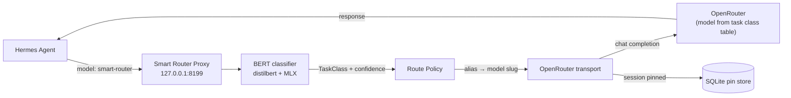

# Smart Router Proxy

An OpenAI-compatible proxy server with task-aware model routing. Any OpenAI SDK
client points at this proxy, requests the virtual model `smart-router`, and each
request is classified and routed to the optimal upstream model on OpenRouter.

**Classification pipeline:**
1. **BERT classifier** — local DistilBERT + MLX model (~5–15ms, ~87% accuracy)

This is the standalone-server counterpart to the
[hermes-smart-router](https://github.com/KevinOBytes/hermes-smart-router) Hermes
plugin — same routing logic, exposed as an OpenAI-compatible endpoint.

## Quick Start (one command)

```bash
git clone https://github.com/KevinOBytes/smart-router-proxy
cd smart-router-proxy
./install.sh install
```

`install.sh install` does everything:

1. Verifies macOS Apple Silicon (this build; ONNX bundle planned for other platforms)
2. Installs `uv` if missing
3. Creates a virtual environment and syncs all dependencies (`uv sync --extra classifier`)
4. Downloads the complete classifier model bundle from the pinned GitHub Release
5. Verifies the SHA-256 checksum
6. Extracts the model to `~/.smart-router-proxy/classifier-model`
7. Creates `config.yaml` from `config.example.yaml` if absent
8. Installs and starts the macOS LaunchAgent
9. Waits for health confirmation

After install, verify:

```bash
curl -s http://127.0.0.1:8199/healthz
# {"server":true,"classifier":true,"upstream_key_set":true}

./install.sh verify   # full check: deps, model files, classifier self-test, health
./install.sh status   # service + model state
```

### OpenRouter API key

The proxy reads `OPENROUTER_API_KEY` from `~/.hermes/.env` (via `run.sh`).
If that file does not exist, set it before starting:

```bash
echo 'OPENROUTER_API_KEY="sk-or-v1-..."' >> ~/.hermes/.env
```

Or export it in your shell and run the proxy in the foreground (see below).

## The Classifier Model

The classifier is a DistilBERT base + trained MLX classifier head. It is
distributed as a complete, self-contained bundle so the proxy runs fully
offline after installation — no Hugging Face download at runtime, no model
revision drift.

| Component | Size | Source |
|---|---|---|
| Custom classifier head + tokenizer | 1.6 MB | Trained from [prompt-classifier](https://github.com/KevinOBytes/prompt-classifier) |
| DistilBERT base weights + tokenizer | ~256 MB | `distilbert-base-uncased` (Apache-2.0, Hugging Face) |
| **Complete bundle (compressed)** | **~237 MB** | **GitHub Release asset** |

The bundle is pinned in `models/manifest.json`:

```json
{
  "classifier_version": "1.0.0",
  "platform": "darwin-arm64",
  "primary_url": "https://github.com/.../classifier-v1.0.0/smart-router-classifier-v1.0.0-darwin-arm64.tar.zst",
  "sha256": "09362690b19330002e77a969dfea5182dc33b058952d61909d18234f28cf36b9"
}
```

The installer downloads only that exact URL and verifies the checksum before
extraction. To use a locally downloaded archive instead:

```bash
# Place the archive next to the repo, then point the installer at it:
SMART_ROUTER_MODEL_ARCHIVE=/path/to/archive.tar.zst ./install.sh install
```

### Why GitHub Releases, not Git LFS or HF auto-download?

- **Git LFS** has a 10 GiB/month bandwidth quota on GitHub Free/Pro — roughly 40
  downloads of a 256 MB model before downloads are blocked or billed.
- **Hugging Face auto-download** (`from_pretrained`) allows silent model
  revision drift and requires network access at runtime.
- **GitHub Release assets** have no total-size or bandwidth limit and are
  GitHub's intended channel for large versioned binaries.

### Offline installation

```bash
# On a machine with internet:
./install.sh install
# The model is cached at ~/.smart-router-proxy/classifier-model

# On an offline machine with the same architecture:
# Copy the archive and the repo, then:
SMART_ROUTER_MODEL_ARCHIVE=/path/to/smart-router-classifier-v1.0.0-darwin-arm64.tar.zst \
  ./install.sh install
```

### Updating the model

```bash
./install.sh update-model   # re-download, verify, extract, reload service
```

## How It Works

### Classification

Each request is classified into one of 8 task types:

| Task Class | Primary Model | Escalation Model |
|---|---|---|
| `structured_simple` | luna (GPT-5.6) | glm (GLM-5.2) |
| `agentic_execution` | deepseek_flash | sol (GPT-5.6) |
| `software_engineering` | glm (GLM-5.2) | opus (Claude-5) |
| `security_engineering` | sol (GPT-5.6) | fable (Claude-5) |
| `knowledge_reasoning` | glm (GLM-5.2) | kimi_k3 |
| `writing_communication` | sonnet (Claude-5) | opus (Claude-5) |
| `computer_use` | sonnet (Claude-5) | opus (Claude-5) |
| `visual_frontend` | kimi_k3 | opus (Claude-5) |

### Session Pinning

Once a session is routed to a model, that choice is pinned for the session TTL
(default 1 hour). Each hit refreshes the pin so active conversations never
re-route mid-stream. Pins survive proxy restarts via SQLite storage. The proxy
reads the session key from `body.session_id` (Hermes/OpenRouter form),
`body.user` (OpenAI form), or `X-Session-Id` / `X-Hermes-Session-Id` headers.

### Usage Ledger

The proxy tracks token counts, costs, and latency per model. Query stats:

```bash
curl http://127.0.0.1:8199/v1/stats
```

## Control Panel

A localhost-first web control panel ships with the proxy at:

```text
http://127.0.0.1:8199/ui
```

It is served by the existing FastAPI process — no separate daemon, Node
runtime, or public service. The panel shows:

- live health for the proxy, classifier, OpenRouter upstream, and Ollama;
- the eight task-class routing rows with searchable primary/fallback pickers
  (OpenRouter models first, installed Ollama models selectable per route);
- a classifier test box (classification only — never calls a provider);
- behavior settings (mode, fixed alias, response annotation, pin TTL);
- upstream endpoint settings (secret values are never displayed — only
  whether the named env var is present in the process);
- session pins (content-free records) with clear-one / clear-all.

Route and behavior changes apply immediately to new sessions and persist
atomically to `config.yaml` (temp file + rename). Existing session pins are
preserved. The admin API lives under `/api/admin/*` behind the same
loopback / client-auth boundary as the proxy itself.

## Configuration

Create `config.yaml` (the installer does this from `config.example.yaml`):

```yaml
server:
  host: "127.0.0.1"
  port: 8199

upstream:
  base_url: "https://openrouter.ai/api/v1"
  api_key_env: "OPENROUTER_API_KEY"

classifier:
  model_path: ~/.smart-router-proxy/classifier-model
  confidence_threshold: 0.45

mode: active  # or "fixed" to always use one model
fixed_alias: "luna"

session_ttl_seconds: 3600
```

Or set `SMART_ROUTER_PROXY_CONFIG` to a custom path.

## Pointing an OpenAI client at the proxy

```python
from openai import OpenAI

client = OpenAI(
    base_url="http://127.0.0.1:8199/v1",
    api_key="ignored-by-proxy",
)

response = client.chat.completions.create(
    model="smart-router",  # virtual model — proxy routes to the best model
    messages=[{"role": "user", "content": "write a python function to sort a list"}],
)
```

## Using With Hermes Agent

Hermes can route its model traffic through this proxy so the classifier
picks which OpenRouter model handles each task. This is the same routing
logic as the
[hermes-smart-router](https://github.com/KevinOBytes/hermes-smart-router)
plugin, but driven by the standalone server.

### Wiring (`~/.hermes/config.yaml`)

Add a provider pointing at the proxy, and select it:

```yaml
model:
  default: smart-router            # route through the classifier
  provider: smart-router-proxy

providers:
  smart-router-proxy:
    name: Smart Router Proxy
    api: http://127.0.0.1:8199/v1
    key_env: OPENROUTER_API_KEY
    transport: openai_chat
```

- `run.sh` pulls `OPENROUTER_API_KEY` from `~/.hermes/.env`, so make sure
  it's set there.
- `model.default: smart-router` is the *virtual model* name the proxy
  intercepts. Any request with that model name is classified and routed.
- Because Hermes sends real agent sessions through it (tool loops, long
  threads), every turn re-classifies and is billed to whatever OpenRouter
  model the table selected. This is **not** free passthrough.

### How a request flows



1. Hermes sends each turn to the proxy with `model=smart-router`.
2. The BERT classifier tags the task class (and risk/sensitivity).
3. The route policy maps class → alias → concrete OpenRouter slug.
4. The transport proxies the call; the choice is pinned per session (SQLite)
   so active tool loops don't re-route and blow the prompt cache.

### Turn it back off

Just point `model.default` back at a concrete model and drop the provider
block (or leave it but don't select it):

```yaml
model:
  default: deepseek/deepseek-v4-flash-0731   # direct — bypasses the proxy
  provider: openrouter
```

### ⚠️ Cost safety (read before leaving it on)

The routing table sends *every* request in a class to its selected model,
and a single agent session can rack up hundreds of calls. On this machine
an unmonitored deployment ran **1,398 calls ($133)** to the
`security_engineering` fallback (`anthropic/claude-fable-5`) before it was
spotted. `fable` is the escalation model — it is expensive and is *not*
where generic traffic should land.

Before routing real traffic:

1. **Watch what's being routed** — set `annotate_response: true` in
   `config.yaml` so every reply carries a `[task_class :: model (alias)]`
   tag, and poll the ledger:
   ```bash
   curl http://127.0.0.1:8199/v1/stats
   ```
2. **Keep spend visible** — the control panel (http://127.0.0.1:8199/ui)
   shows live routing; check it periodically.
3. **Consider `mode: fixed`** (`fixed_alias: luna`) if you want a cheap,
   predictable default while you validate the classifier, instead of the
   expense-prone active table.
4. **Know the fallback table** — `security_engineering` escalates to
   `fable`, `software_engineering`/`writing`/`computer_use` to `opus`.
   These are the premium Claude-5 models. They are appropriate for the
   task but they are the cost drivers.
5. **Shut it off when not in use** — `./install.sh uninstall` removes the
   LaunchAgent and leaves no process or port behind.

If you do not need per-task routing, don't enable it: the direct
OpenRouter path (default Hermes config) is simpler and cheaper.

## Client Auth

Set `SMART_ROUTER_PROXY_TOKEN` to require a bearer token from clients.

## Response Annotation

Set `annotate_response: true` in `config.yaml` to prepend a visible routing
tag to each assistant reply so callers can see which task class and model
answered:

```
[software_engineering :: z-ai/glm-5.2 (glm)]
<assistant content follows>
```

Applied to both streaming and non-streaming chat completions. Off by default.
The routed concrete model is always written to the response `model` field
regardless of this flag.

## Run as a Service (macOS)

The installer handles this. Manual equivalents:

```bash
./install.sh install     # install + start as a login service
./install.sh status      # show load state, process, port
./install.sh start       # start an installed service
./install.sh stop         # stop (KeepAlive relaunches it)
./install.sh uninstall   # stop and remove the service
```

How it works:

- Generates `~/Library/LaunchAgents/com.kevinbytes.smart-router-proxy.plist`
  from `com.kevinbytes.smart-router-proxy.plist.tpl`, substituting the repo
  path and a `log/` directory.
- `RunAtLoad=true` starts it at login; `KeepAlive=true` restarts it on crash.
- `run.sh` supplies `OPENROUTER_API_KEY` from `~/.hermes/.env`.
- Logs: `log/proxy.log`, `log/proxy-error.log` (gitignored).

Manual `launchctl` equivalent:

```bash
launchctl bootstrap "gui/$(id -u)" \
  ~/Library/LaunchAgents/com.kevinbytes.smart-router-proxy.plist
launchctl print "gui/$(id -u)/com.kevinbytes.smart-router-proxy"
launchctl bootout "gui/$(id -u)/com.kevinbytes.smart-router-proxy"
```

To run in the foreground instead (not as a service):

```bash
./run.sh
```

## Supported Platforms

- **macOS Apple Silicon** (this release): MLX classifier head + PyTorch
  DistilBERT feature extractor.
- **Linux / Windows / Intel Mac**: planned via an ONNX Runtime bundle. The
  current installer will refuse with a clear message on unsupported platforms.

## License

MIT (proxy source and trained classifier head).
DistilBERT base weights are Apache-2.0, © Hugging Face.
